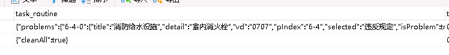
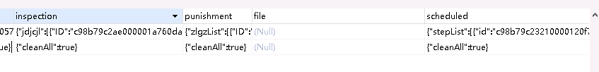
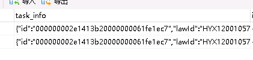
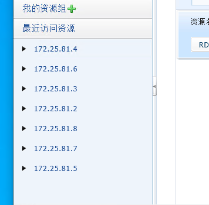

为空的





task_info




```json
{
	"id": "000000002e1413b20000000061fe1ec7",
	"lawId": "HYX120010572",
	"itemBh": "XF20210929163289730454218",
	"oldItemBh": "XF20210929163289730454218",
	"itemName": "成都辉耀探案文化传播有限公司",
	"dwId": "51001201012496",
	"dwMc": "成都辉耀探案文化传播有限公司",
	"dwDz": "锦江区总府路18号1栋1单元-1层15号",
	"itemTypeSub": "J0",
	"zgDwId": "51001201",
	"dateCreated": "2021-09-29",
	"dateCompleted": null,
	"jzDate": "2021-10-31",
	"clTime": null,
	"cbrAcc": "51000263",
	"cbrAccName": "刘容",
	"xcbAcc": "51129221",
	"xcbAccName": "姜楠",
	"acc": "51000263",
	"accName": "刘容",
	"inTime": "2021-09-29 14:35:05",
	"deleted": "0",
	"chgTime": "2021-09-29 14:33:43.133",
	"relationItemBh": null,
	"itemState": "7", //这两个
	"itemResult": "0",//这两个
	"state": "0",
	"flag": null,
	"taskOrigin": "21",
	"xcbOrgName": "锦江区消防救援大队",
	"step": "1",
	"remark": "",
	"modified": true //加这个
}
```


成都


