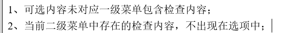
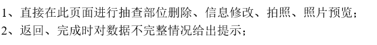
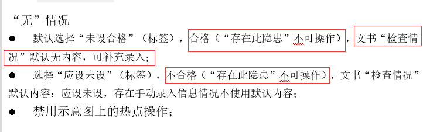
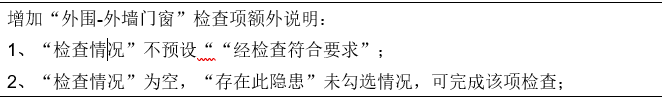

- [ ] 长按添加检查内容 

  

- [ ] 编辑已完成检查项
  

- [ ] 标签形态 

  无抽查部位进入 有默认"经检查符合要求"标签, 无默认"未设合格"标签,完成任务进去还是显示标签

  

  

- [ ] 

  

  ### 可修改bug

- [ ] 自动喷水灭火其他设施名字  3364

- [ ] 其他资料文书文字太多 撑爆文书  3381

- [x] 三合一 等问题项名字修改  应急广播问题项不对

- [x] 在岗人数必填 ,检查情况正常显示 3445

- [x] 删除检查项 已填检查项会被清空 3409

- [x] 消防积水 自动喷火 大项有无不正确

- [x] 其他自动灭火未进文书 3420 

- [x] 防火门有无没勾选 3422

- [x] 其他设施删除名字遗留文书 3423

- [x] 没写压力值 undfind 3424

- [x] 三合一等未进文书检查内容  3441

- [x] 弹出窗口 点外围会消除 3451

- [ ] 其他资料 点击问题返回未复原 3477

- [x] 多个文书生成 少docid 3470

- [x] 手动抽查部位清空 3489

- [x] 抽查部位文字错误 3488

- [x] 已检查返回功能与完成一样 3487

- [ ] 已检查提示保存 点击保存不能为空 3501 3232

- [ ] 建筑物信息  定位后删除内容 不会保存 3485

- [ ] 有步进器检查项 检查情况覆盖问题  3496 3497

- [ ] 已经生成文书检查项 不能修改

  

  

  

  

### 可关闭bug

- [x] 3470 3484
- [x] 3409
- [x] 3488 
- [x] 3489
- [x] 3487
- [x] 3491

- [ ] 其他资料 其他情况2 丢失 (未进核查页面)
- [ ] 下发文书后 不能返回到检查项
- [ ] 下发文书后不能修改 (抽查部位不能删除修改)
- [ ] 下发文书后 有检查项下发文书 大项应该不能设置 应设未设 和 未设合格 
- [ ] 应设未设 或者 未设合格 后其他设施名字未删除
- [ ] 消防积水点应设未设后,外部有检查, 总项还是勾的无
- [ ] 末端试水压力值为0 不显示

