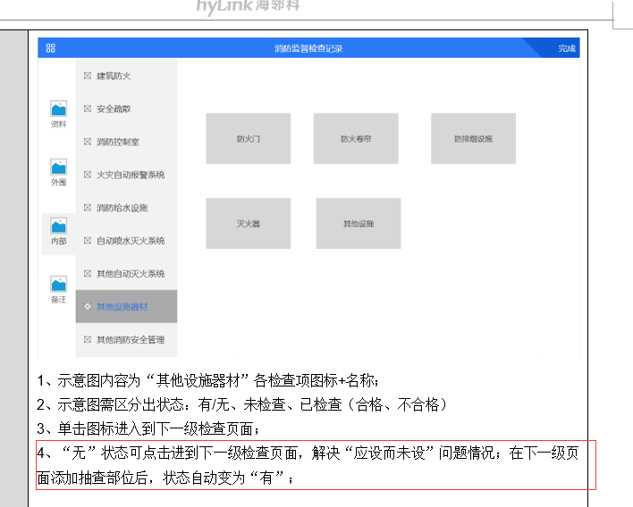
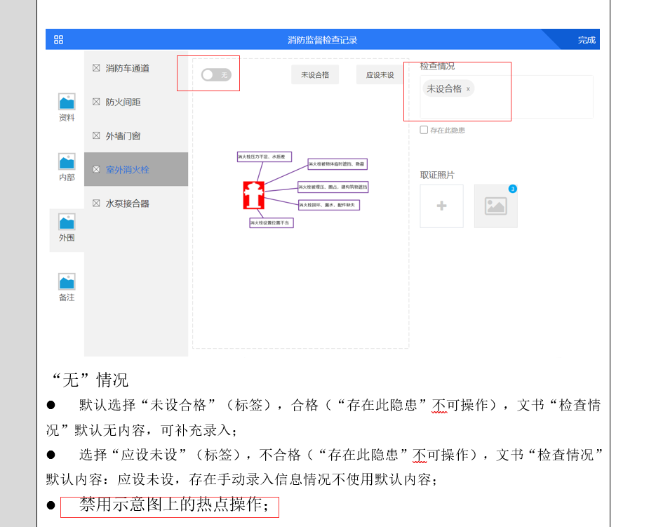
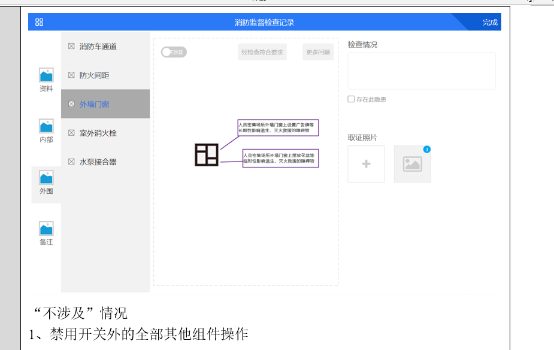

- [x] #### 编辑未保存提示框

- [x] #### 状态自动更新  

- [x] #### 外部按钮逻辑

- [x] #### 备注功能

- [ ] #### 指南针

- [x] #### 建筑物信息数据结构调整

- [ ] #### 拍照 添加图片功能

- [ ] #### 数据存在数据库 (页面得重写)

- [ ] #### 有 id不能修改

- [x] #### 其他设施抽屉选择

- [x] #### 无抽查部位怎么清除检查

- [x] 其他资料点击状态 自动跳到最上

- [x] 其他资料 +其他情况 完成后更新状态

- [x] 其他资料 无制度文本不一 和可以在图表上选择无制度

- [x] 外围退出提示  开关对应编号

- [x] 内部 应设未设 未设合格 编号修改

- [x] 内部 输入框字数限制 无制度文本不一 和可以在图表上选择无制度

- [x] 给水 “外围”室外消火栓、水泵接合器“有”、“无”联动：室外消火栓、水泵接合器增加检查内容后，自动取消“消防给水设施”无的勾选，且不能勾选（勾选时做出相关提示）；

- [x] 

- [x] 

- [x] 

  

  

  - [ ] 建筑物信息状态显示 其他情况插入文书

  - [ ] 其他资料第一次进任务不刷新页面

  - [ ] 其他资料不涉及 以及其他情况

  - [ ] 消防积水进页面刷新 开关全变

  - [ ] 任务开关默认有

  - [ ] 外墙门窗重进 会清空

  - [ ] 无备注

    

  

  

  

  ​	

  - [ ] 单位基本信息保存

  - [ ] 其他资料不涉及 以及其他情况

  - [ ] 其他资料第一次进任务不刷新页面

  - [ ] 相机 拍照

  - [ ] 抽查部位bug  一直不变  

  - [ ] 更多问题选项 

  - [ ] 指南针

  - [ ] 其他灭火无状态显示 问题项

  - [ ] 其他设施 与 

  - [ ] 等

  - [ ] 无备注

  - [ ] 外围保存方式

  - [ ] 任务项不能修改

  - [ ] 任务项返回

    

